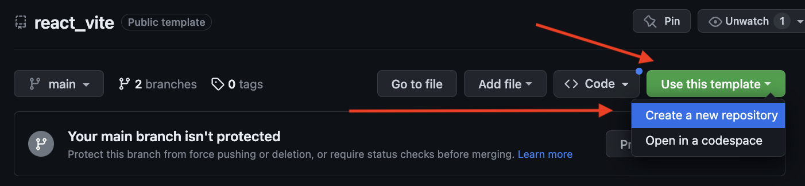
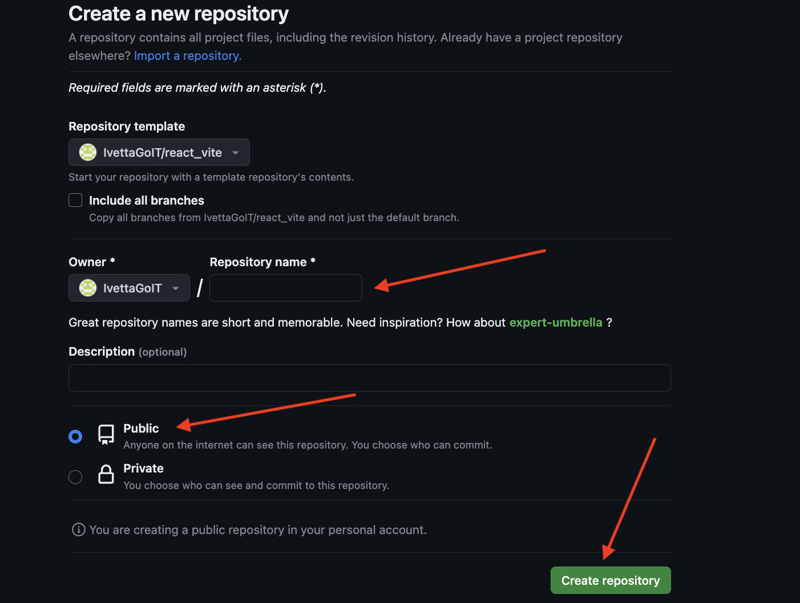
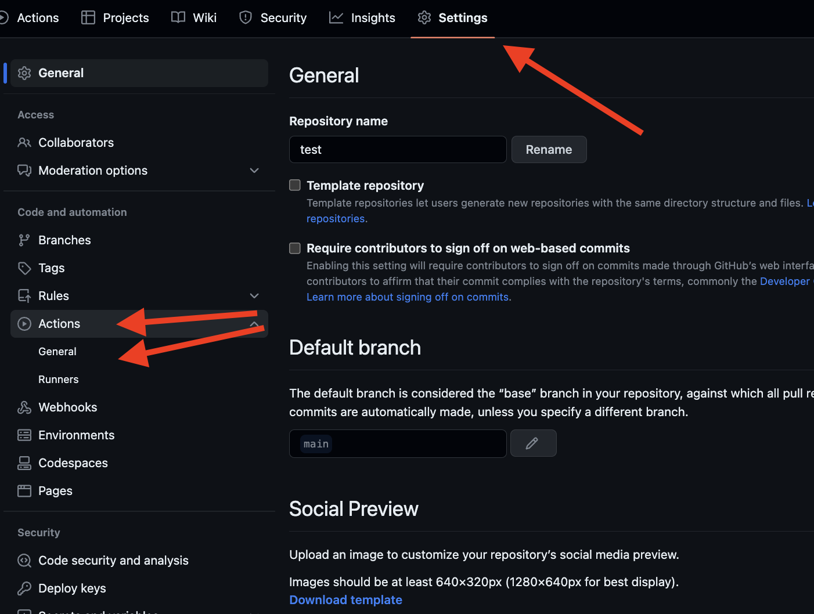
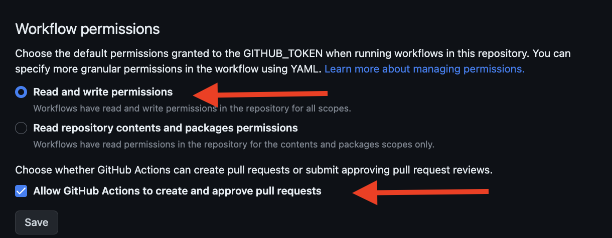
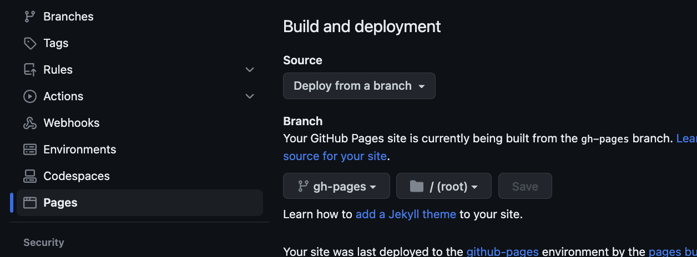
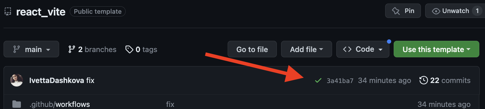
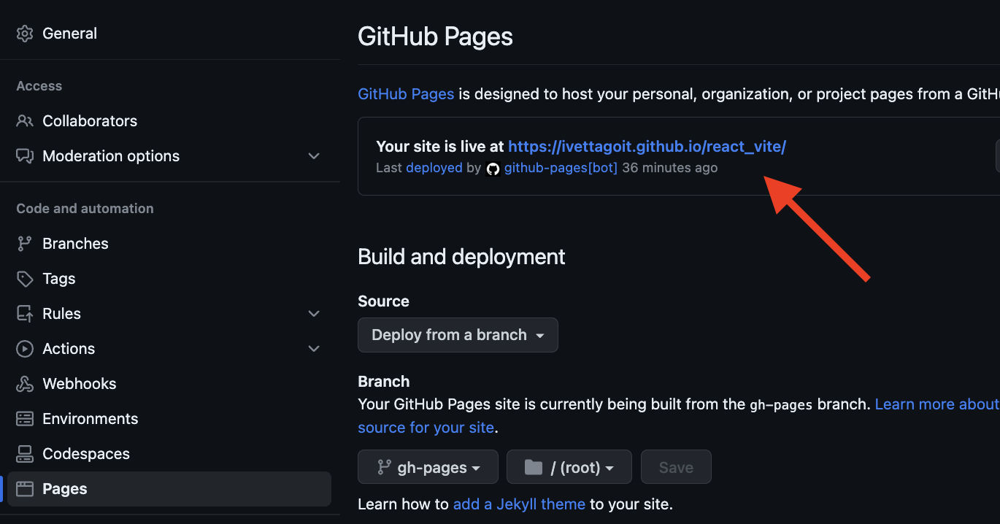

# React + Vite template

Цей проєкт було створено за допомогою [Create Vite](https://vitejs.dev/). Для
знайомства і налаштування додаткових можливостей
[звернися до документації](https://vitejs.dev/guide/).

## Створення репозиторію за шаблоном

Використовуй цей репозиторій організації GoIT як шаблон для створення
репозиторію свого проєкту. Для цього натисни на кнопку `"Use this template"` і
обери опцію `"Create a new repository"`, як показано на зображенні.



На наступному кроці відкриється сторінка створення нового репозиторію. Заповни
поле його імені, переконайся що репозиторій публічний, після чого натисни кнопку
`"Create repository from template"`.



Після того як репозиторій буде створено, необхідно перейти в налаштування
створеного репозиторію на вкладку `Settings` > `Actions` > `General` як показано
на зображенні.



Проскроливши сторінку до самого кінця, у секції `"Workflow permissions"` вибери
опцію `"Read and write permissions"` і постав галочку в чекбоксі. Це необхідно
для автоматизації процесу деплою проєкту.



Тепер у тебе є особистий репозиторій проєкту, зі структурою файлів і папок
репозиторія-шаблону. Далі працюй з ним як з будь-яким іншим особистим
репозиторієм, клонуй його собі на комп'ютер, пиши код, роби комміти і відправляй
їх на GitHub.

## Підготовка до роботи

1. Переконайся, що на комп'ютері встановлена LTS-версія Node.js.
   [Скачай і встанови](https://nodejs.org/en/) її якщо необхідно.
2. Встановіть базові залежності проекту командою `npm install`.
3. Запустіть режим розробки, виконавши команду `npm run dev`.
4. Перейди в браузері за адресою, що зазначено в терміналі.

## Деплой

Продакшн версія проєкту буде автоматично збиратися і деплоїтися на GitHub Pages,
у гілку `gh-pages`, щоразу, коли оновлюється гілка `main`. Наприклад, після
прямого пушу або прийнятого пул-реквесту. Для цього необхідно у файлі
`vite.config.js` відредагувати поле `base`, замінивши `react_vite` на свою назву
репозиторію `"/your_repo_name"`, і відправити зміни на GitHub.

Далі необхідно зайти в налаштування GitHub-репозиторію (`Settings` > `Pages`) і
виставити роздачу продакшн версії файлів із папки `/root` гілки `gh-pages`, якщо
це не було зроблено автоматично.



### Статус деплоя

Статус деплою крайнього коміту відображається іконкою біля його ідентифікатора.

- **Жовтий колір** - виконується збірка і деплой проєкту.
- **Зелений колір** - деплой завершився успішно.
- **Червоний колір** - під час збирання або деплою сталася помилка.

Детальнішу інформацію про статус можна подивитися, клікнувши на іконку, і в
випадаючому вікні перейти за посиланням `Details`.



### Жива сторінка

Через якийсь час, зазвичай кілька хвилин, живу сторінку можна буде подивитися за
адресою, вказаною в налаштуваннях GitHub-репозиторію (`Settings` > `Pages`).



Якщо відкривається порожня сторінка, переконайся що у вкладці `Console` немає
помилок пов'язаних із неправильними шляхами до CSS і JS файлів проекту
(**404**). Швидше за все найімовірніше, у тебе неправильне значення поля `base`
у файлі `vite.config.js`.

### Маршрутизація

Якщо додаток використовує бібліотеку `react-router-dom` для маршрутизації,
необхідно додатково налаштувати компонент `<BrowserRouter>`, передавши в пропе
`basename` точну назву твого репозиторію. Слеш на початку рядка обов'язковий.

```jsx
<BrowserRouter basename="/your_repo_name">
  <App />
</BrowserRouter>
```
### Додавання змінних в  .env
Для зберігання конфігураційних даних, таких як API ключі, адреси серверів, порти та інші змінні використовуйте файл `.env`. Для цього необхідно з назви файлу `.env.template` видалити зайві ".template",після чого файл відповідатиме умовам файлу `.ignore` і буде зберігатися лише локально, не публікуючись на віддаленому репозиторії з метою безпеки. Задля використання змінних на GitHub-pages усі змінні, передбачені файлом .env, слід додати до файлу `.github/workflows/deploy.yml`, а також до налаштувань репозиторію. Для цього слід перейти (`Settings` > `Secrets and variables` > `Actions`)


## Як це працює

1. Після кожного пушу в гілку `main` GitHub-репозиторію, запускається
   спеціальний скрипт (GitHub Action) з файлу `.github/workflows/deploy.yml`.
2. Усі файли репозиторію копіюються на сервер, де проєкт ініціалізується і
   проходить збірку перед деплоєм. 3 Якщо всі кроки пройшли успішно, зібрана
   продакшн-версія файлів проєкту відправляється в гілку `gh-pages`. В іншому
   випадку, в логах виконання скрипта буде вказано в чому проблема.
